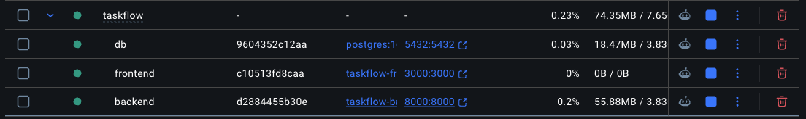

# TaskFlow

A lightweight, full-stack project and task management application built for the **PyCon 2026** workshop: *Beyond Vibe Coding: Spec-Driven Development with Code Graphs*.

TaskFlow is a hands-on sandbox for modern development workflows. Organize work into projects, track tasks from ready to done, explore a REST API, and practice spec-driven iteration in an environment that mirrors real production stacks.

**Stack:** Next.js · FastAPI · PostgreSQL · Alembic · Docker · Miniconda

---

## Choose your setup

| | 🐳 Docker | 💻 Local development |
| --- | --- | --- |
| **Best for** | Workshops, demos, zero local setup | Day-to-day coding with hot reload |
| **Runs in Docker** | Database, API, frontend | Database only |
| **Runs on your machine** | Nothing | API (conda) + frontend (Node.js) |
| **Start command** | `make up` | `make dev` |
| **See changes** | Rebuild with `make up` | Save file and refresh |

---

# 🐳 Docker setup

Run the entire stack in containers. No Python, Node.js, or conda required on your machine.

## Prerequisites

- [Docker](https://docs.docker.com/get-docker/)
- [Git](https://git-scm.com/)

## Quick start

```bash
git clone https://github.com/esneiderbravo/taskflow.git
cd taskflow
make up
```

The first build takes about 90 seconds. Subsequent starts are under 30 seconds.

In Docker Desktop, you should see three running containers under the **taskflow** stack: `db`, `frontend`, and `backend`.



## Service URLs

| Service | URL |
| ------- | --- |
| 🖥️ Frontend | [http://localhost:3000](http://localhost:3000) |
| 📖 API docs | [http://localhost:8000/docs](http://localhost:8000/docs) |
| ❤️ Health check | [http://localhost:8000/health](http://localhost:8000/health) |

```bash
curl http://localhost:8000/health
# {"status":"ok"}
```

## Daily commands

```bash
make up      # build and start all services
make down    # stop all services
make logs    # follow container output
make test    # run backend and frontend tests
```

## Seeing your changes (Docker)

Edits are **not** picked up automatically. The stack uses production builds.

1. ✏️ Save your changes under `frontend/` or `backend/`.
2. 🔁 Rebuild and restart: `make up`
3. ⏳ Check startup: `make logs` (look for `Application startup complete`)
4. 🌐 Refresh [http://localhost:3000](http://localhost:3000)

## Database migrations (Docker)

Schema changes are managed with [Alembic](https://alembic.sqlalchemy.org/). Migration files live in `backend/alembic/versions/`.

```bash
# Create a migration (saved to your local files)
make migrate-create MSG="describe your change"
make up

# Apply pending migrations on a running stack
make migrate

# Wipe database and start fresh (schema + demo seed)
make reset
```

## Docker command reference

| Command | Description |
| ------- | ----------- |
| `make up` | Build and start all services |
| `make down` | Stop all services |
| `make logs` | Follow container logs |
| `make migrate` | Apply pending migrations |
| `make migrate-create MSG="..."` | Generate a new migration file |
| `make reset` | Wipe database volume and restart |
| `make test` | Run backend and frontend tests |

---

# 💻 Local development setup

Run the API and frontend on your machine with hot reload. PostgreSQL always runs in Docker. Python dependencies are managed in a conda environment named **`task-flow`**.

## Prerequisites

- [Docker](https://docs.docker.com/get-docker/) (database only)
- [Miniconda](https://www.anaconda.com/download/success) (Python 3.12)
- [Node.js](https://nodejs.org/) (LTS)
- [Git](https://git-scm.com/)

Restart your terminal after installing Miniconda.

## Quick start

**macOS / Linux:**

```bash
git clone https://github.com/esneiderbravo/taskflow.git
cd taskflow
chmod +x scripts/dev-local.sh
make dev
```

**Windows (PowerShell):**

```powershell
git clone https://github.com/esneiderbravo/taskflow.git
cd taskflow
.\scripts\dev-local.ps1
```

### What `make dev` does

On first run it will:

1. 🐍 Create the **`task-flow`** conda environment from `environment.yml`
2. 📦 Install backend and frontend dependencies
3. ⚙️ Copy `.env.example` to `.env` if missing

Every run then:

1. 🗄️ Starts PostgreSQL in Docker (`db` container)
2. 📜 Runs Alembic migrations
3. ⚡ Starts the API with hot reload (conda env `task-flow`)
4. 🖥️ Starts the Next.js dev server

Press `Ctrl+C` to stop the API and frontend. The database container keeps running.

## Service URLs

| Service | URL |
| ------- | --- |
| 🖥️ Frontend | [http://localhost:3000](http://localhost:3000) |
| 📖 API docs | [http://localhost:8000/docs](http://localhost:8000/docs) |
| 🗄️ Database | `localhost:5432` (Docker container `db`) |

## Seeing your changes (local)

Save your changes and refresh the browser. The backend (`--reload`) and frontend (`next dev`) pick up changes automatically. No rebuild required.

## Database migrations (local)

```bash
# Create a migration
make dev-migrate-create MSG="describe your change"
make dev-migrate

# Reset database (schema + demo seed)
make dev-reset
```

Restart `make dev-backend` if the API is already running.

## Run services separately (optional)

```bash
make dev-db         # PostgreSQL only
make dev-migrate    # migrations only
make dev-backend    # API only (uses conda env task-flow)
make dev-frontend   # frontend only
make dev-test       # run tests
```

## Windows without Make

```powershell
.\scripts\dev-local.ps1
```

## Local command reference

| Command | Description |
| ------- | ----------- |
| `make dev` | Setup (if needed), start DB, migrate, API, and frontend |
| `make dev-db` | Start PostgreSQL in Docker only |
| `make dev-migrate` | Apply pending migrations |
| `make dev-migrate-create MSG="..."` | Generate a new migration file |
| `make dev-backend` | Start API with hot reload |
| `make dev-frontend` | Start Next.js dev server |
| `make dev-test` | Run backend and frontend tests |
| `make dev-reset` | Wipe database volume and re-run migrations |
